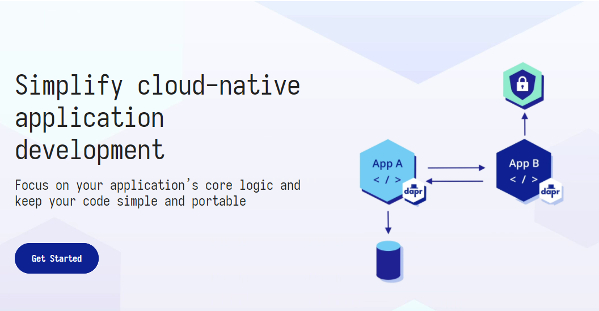

# Dapr SIG

Dapr SIG 是 [云原生社区](https://cloudnative.to) 主办的特别兴趣小组（SIG）。SIG 目的是给志同道合的人共同学习和交流的平台。本小组主题为 [Dapr](https://dapr.io/)，专注研究 Dapr 的理论及实践，理解源码并参与社区贡献。加入小组， 和 Service Mesher 一起了解 Dapr 最新的进展，一起交流，一起成长。

云原生社区 Dapr SIG 主页：[https://i.cloudnative.to/dapr/](https://i.cloudnative.to/dapr/)（点击阅读原文可跳转到该页面），该页面使用 GitBook 组织，你可以访问 [https://github.com/cloudnativeto/sig-dapr](https://github.com/cloudnativeto/sig-dapr) 参与贡献。加入 Dapr SIG 还可以参与更多社区的线上线下活动。

云原生社区各个 SIG 的讨论组基于微信组织，群内大牛云集，汇集国内各大公司的 Service Mesh 团队成员。为了保障 SIG 群的质量，入群需要在申请表中实名登记。扫描下面的二维码加入云原生社区 Dapr SIG，了解更多 Dapr 实践案例，并与 Dapr 专家、爱好者们共同交流。

## 简单资源整理

* [Dapr GitHub Repo](https://github.com/dapr/dapr): GitHub 库, 核心代码.
* [Dapr Blog](https://blog.dapr.io/posts): 也可以由主页进入.
* [Dapr 官网](https://dapr.io/): 首页可以满足基本的资料要求.
* [Dapr Doc](https://github.com/dapr/docs): 相关文档, 已经做成了网站
* [DIscord](https://discord.com/invite/ptHhX6jc34): 官方聊天室 已经转移到了 Discord. 点击链接加入
* [Dapr 的 Todo 面板](https://www.tickgit.com/browse?repo=github.com/dapr/dapr): 除了 issues 外还可以参与这里的开发。

同时可以查看以下建议

### 我是感兴趣的新人

> 来自群友-敖小剑 skyao：
>
> 目前文档翻译进展如图，前两项已经翻译完成并上线。我建议按照新人接触 Dapr 的常见路线，读完concept 之后，接下来有兴趣的同学应该是通过 getting-started 开始动手尝试了。然后是 developing application。

### 欢迎贡献

如果有合适的资源欢迎提交 PR（Pull Request）合入推荐阅读文章。同时推荐加入我们的社区微信群，和中国的 Dapr 使用者们一同交流经验。

## 加入我们

[填写问卷申请加入云原生社区。](https://wj.qq.com/s2/8219652/fb37)

