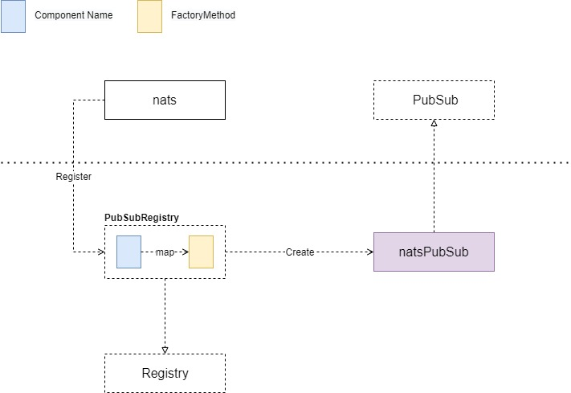
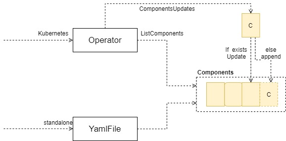
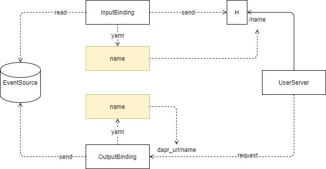
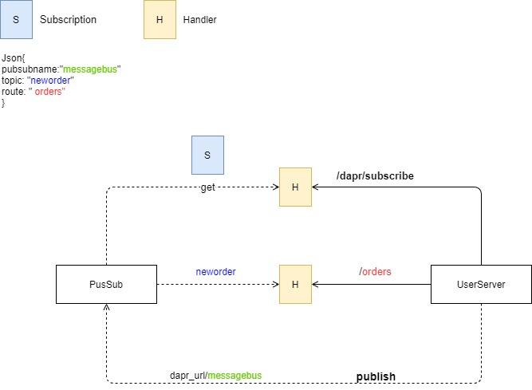
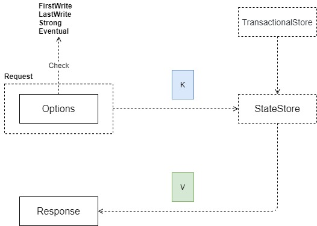
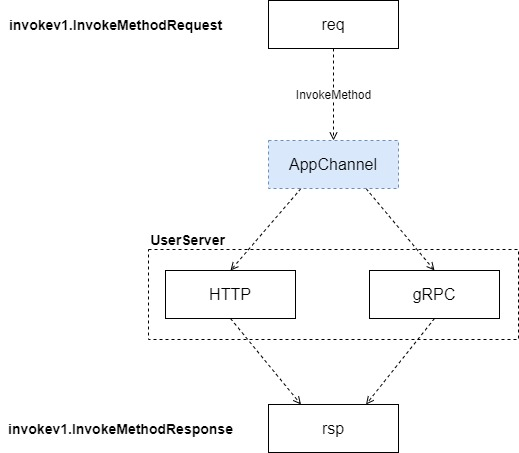
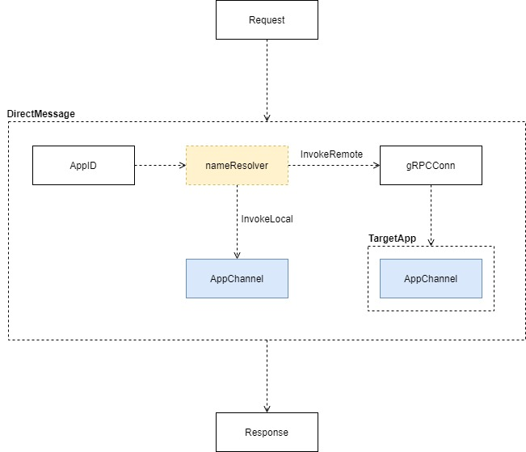
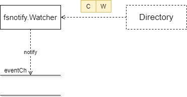
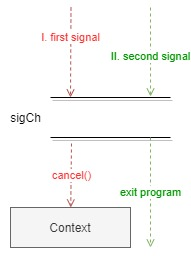
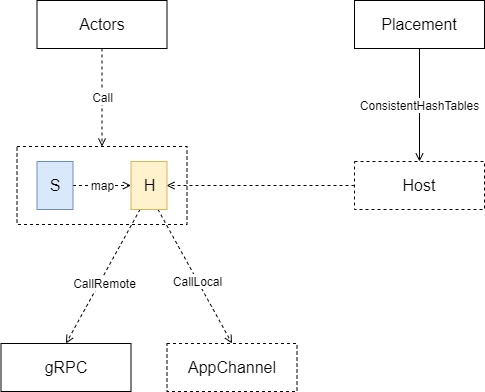

# Dapr 源码解析分享 v1

**Dapr**

**Ability Introduction**

**Runtime**

通过配置生成 Runtime 初始化各组件, Actor 服务, gRPC 和 HTTP 等服务. 通过 AppChannel 与 UserServer 通信.

**Runtime Components Init**

如果 UserCode 有监听端口传入 Dapr flag, 则为 runtime 新建 AppChannel 负责和 UserServer 通信.

组件可插拔, 同一个外部应用可以扮演不同组件角色.

**Components**

**Registry**

组件的实现都在另一个库 dapr/components-contrib 里.

Registry 接口含 Register 和 Create 两个函数签名. 组件实现之后注册到相应组件的 Registry 中.

Create 时, 参数带 Component Name 调用指定的 FactoryMethod 方法生成组件实例.

**BindingComponents**

**Binding API**

Dapr 的 API 命名机制使用 components 的 YAML 配置文件中 components 的 name 来作为 API 的命名.

**PubSub**

**Pubsub API**

用户使用 Dapr 的 Pubsub 功能时, 需提供 Handler 以供 Dapr 访问得到用户的订阅信息.

**StateStore**

**Interface**

StateStore 用于 Key-Value State 存储. Options 用于标识 Concurrency 和 Consistency

**AppChannel**

**Interaction with user**

AppChannel 是 Dapr 和 用户代码交互的桥梁.

**DirectMessage**

**Snippets**

**Watch**

通过 fsnotify 包, 监控文件夹下的变动并通知 事件 Channel

**Signal**

捕获 signal 的同时创建 Context. 使关闭时, 优雅通知使用该 Context 的函数关闭.

**Actor \[WIP\]**

**Internal**

Placement 是单独的 HTTP server, 用于存储 Actors 在不同 Host 上的信息. Dapr init 会启动 Placement 的 docker 容器.

Actors 中保存有方法的 API 路径的 string 到不同 Host 的映射, 如果该 actor 应该在本地运行, 则直接调用 AppChannel 和 UserServer 通信, 如果查询该 actor 在远端, 则通过 gRPC 调用远端服务.

